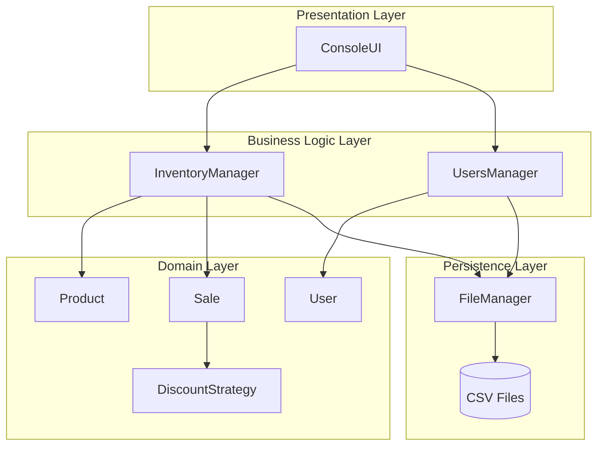
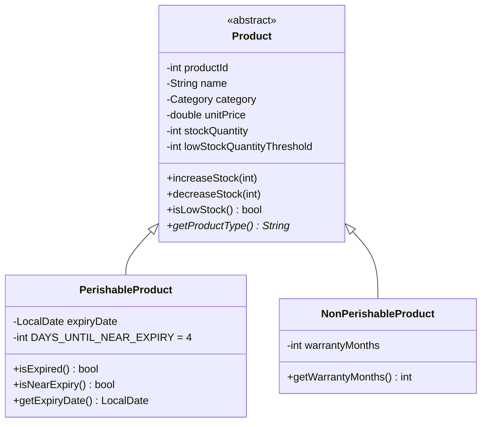
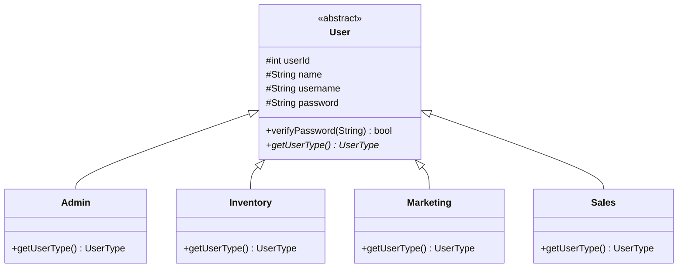
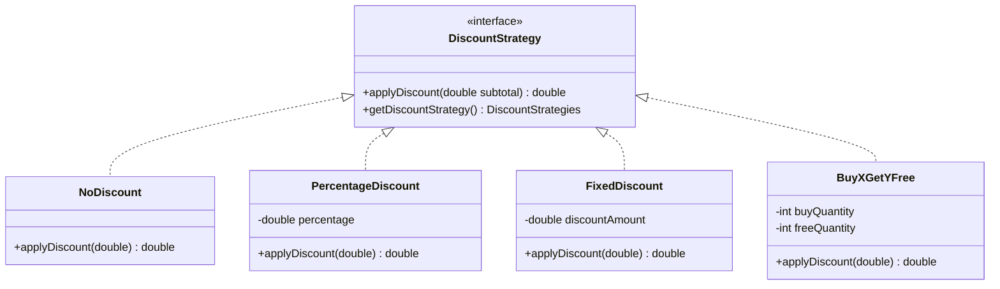
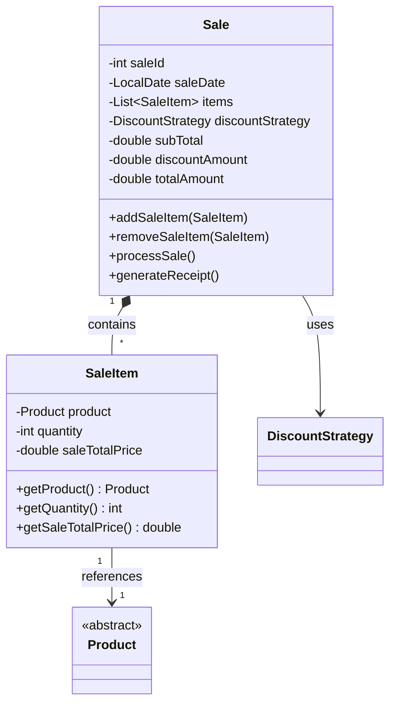
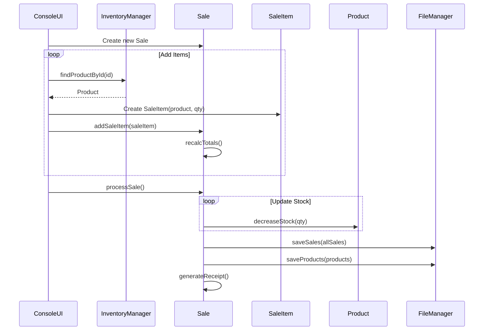
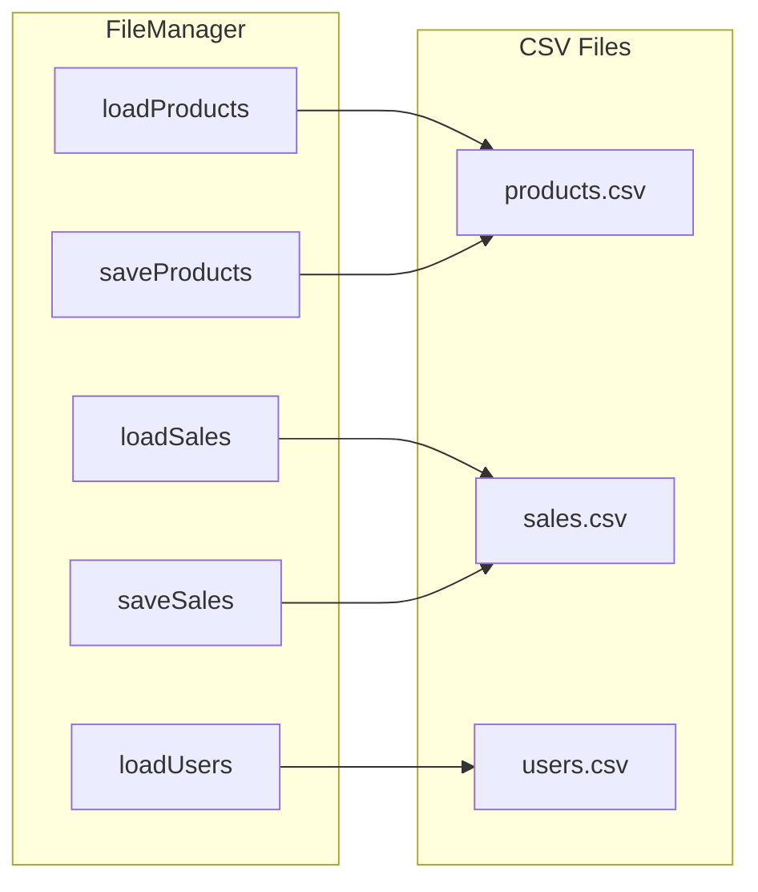
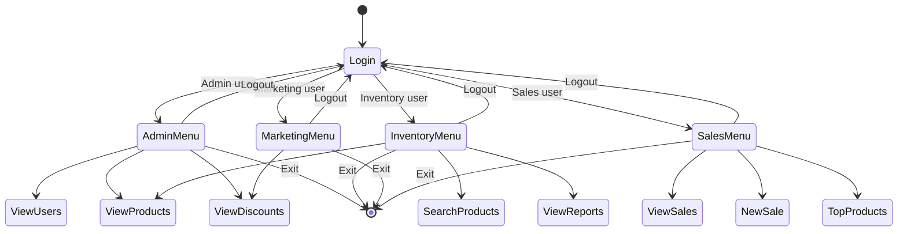

# System Architecture

This document describes the technical architecture of the Hypermarket Management System.

## System Overview

The Hypermarket Management System follows a layered architecture with clear separation of concerns:



## Package Structure

| Package    | Responsibility                     | Key Classes                                                  |
| ---------- | ---------------------------------- | ------------------------------------------------------------ |
| `ui`       | Console user interface             | `ConsoleUI`                                                  |
| `managers` | Business logic and data management | `InventoryManager`, `UsersManager`, `FileManager`            |
| `product`  | Product domain model               | `Product`, `PerishableProduct`, `NonPerishableProduct`       |
| `sales`    | Sales domain model                 | `Sale`, `SaleItem`, `SalesReporter`                          |
| `users`    | User domain model                  | `User`, `Admin`, `Inventory`, `Marketing`, `Sales`           |
| `offers`   | Discount strategies                | `DiscountStrategy`, `NoDiscount`, `PercentageDiscount`, etc. |
| `enums`    | Type enumerations                  | `Category`, `UserType`, `ProductType`, `DiscountStrategies`  |

## Class Hierarchies

### Product Hierarchy



### User Hierarchy



### Discount Strategy Pattern



## Composition Relationships

### Sale Composition



## Data Flow

### Sale Processing Flow



## File Persistence Design

### FileManager Responsibilities



### File Format Design

**Products CSV:**

```
id, name, category, unitPrice, stockQty, lowStockThreshold, type, typeSpecificField
```

- `typeSpecificField` = expiryDate (PERISHABLE) or warrantyMonths (NON_PERISHABLE)

**Sales CSV:**

```
id, date, subtotal, discount, total, items
```

- `items` format: `productId:quantity;productId:quantity;...`

**Users CSV:**

```
userId, role, name, username, password
```

## UI Architecture

### Console UI with JLine

The application uses **JLine 3** library for enhanced console interaction:

- **Arrow key navigation** - Up/Down to select menu items
- **Password masking** - Hidden input for password entry
- **Screen clearing** - Clean transitions between views
- **Colored output** - AttributedString for styled text

### Menu Flow



## Key Design Decisions

### 1. Abstract Base Classes

Both `Product` and `User` are abstract classes requiring subclasses to implement type-specific behavior (`getProductType()`, `getUserType()`).

### 2. Strategy Pattern for Discounts

Discounts are implemented using the Strategy pattern, allowing easy addition of new discount types without modifying existing code.

### 3. Composition over Inheritance

`Sale` contains `SaleItem` objects (composition) rather than inheriting from a collection, providing better encapsulation and control.

### 4. File-Based Persistence

CSV files are used for simplicity and human readability, with `FileManager` centralizing all I/O operations.

### 5. Role-Based Access Control

Different user types have different menu options, implemented through polymorphism and separate menu display methods.

## Validation & Error Handling

- **Constructors** validate all input parameters
- **Setters** include validation logic with descriptive exceptions
- **Stock operations** prevent negative inventory
- **User input** is validated before processing
- **File I/O** uses try-catch with error logging
