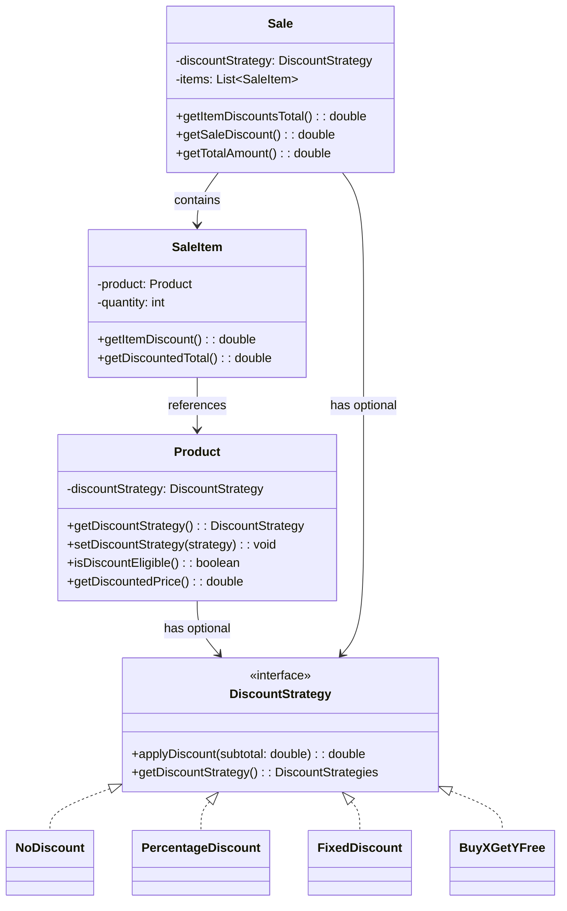

# Discount System Refactor - Dual-Level Design

## Problem Statement

The current discount system only applies discounts at the **Sale level**, which cannot express product-specific promotions like "20% off this TV" or "Buy 2 Get 1 Free on shampoo". A more flexible design should support:

1. **Product-level discounts** - Applied to individual products/items
2. **Sale-level discounts** - Applied to the entire order

---

## Proposed Architecture



---

## How Discounts Stack

| Step             | Calculation                                              |
| ---------------- | -------------------------------------------------------- |
| 1. Item Subtotal | `unitPrice × quantity`                                   |
| 2. Item Discount | Product's `DiscountStrategy.applyDiscount(itemSubtotal)` |
| 3. Item Total    | `itemSubtotal - itemDiscount`                            |
| 4. Sale Subtotal | Sum of all item totals                                   |
| 5. Sale Discount | Sale's `DiscountStrategy.applyDiscount(saleSubtotal)`    |
| 6. Final Total   | `saleSubtotal - saleDiscount`                            |

**Example:**

- Product: TV ($100, 20% off) → Item discount = $20 → Item total = $80
- Sale has 10% off entire order → Sale discount = $8
- **Final Total = $72**

---

## Proposed Changes

### Offers Package

#### [MODIFY] [DiscountStrategy.java](file:///c:/Projects/JavaProject/src/offers/DiscountStrategy.java)

Add a method to check if a discount is active/meaningful:

```java
public interface DiscountStrategy {
    DiscountStrategies getDiscountStrategy();
    double applyDiscount(double subtotal);

    // New: Check if this strategy provides any discount
    default boolean isActive() {
        return getDiscountStrategy() != DiscountStrategies.NO_DISCOUNT;
    }
}
```

---

### Product Package

#### [MODIFY] [Product.java](file:///c:/Projects/JavaProject/src/product/Product.java)

Add discount strategy field and methods:

```diff
 public abstract class Product {
     // ... existing fields ...
+    private DiscountStrategy discountStrategy;

     // Constructor changes
     public Product(int productId, String name, Category category,
                    double unitPrice, int stockQuantity, int lowStockQuantityThreshold) {
         // ... existing validation ...
+        this.discountStrategy = new NoDiscount(); // Default: no discount
     }

+    // New methods
+    public DiscountStrategy getDiscountStrategy() {
+        return discountStrategy;
+    }
+
+    public void setDiscountStrategy(DiscountStrategy strategy) {
+        this.discountStrategy = (strategy == null) ? new NoDiscount() : strategy;
+    }
+
+    public boolean isDiscountEligible() {
+        return discountStrategy.isActive();
+    }
+
+    public double getDiscountedUnitPrice() {
+        double discount = discountStrategy.applyDiscount(unitPrice);
+        return unitPrice - discount;
+    }
 }
```

---

### Sales Package

#### [MODIFY] [SaleItem.java](file:///c:/Projects/JavaProject/src/sales/SaleItem.java)

Update to calculate item-level discounts:

```diff
 public class SaleItem {
     private Product product;
     private int quantity;
-    private double saleTotalPrice;
+    private double itemSubtotal;      // Before product discount
+    private double itemDiscount;      // Product-level discount
+    private double itemTotal;         // After product discount

     public SaleItem(Product product, int quantity) {
         // ... existing validation ...
         this.product = product;
         this.quantity = quantity;
-        this.saleTotalPrice = product.getUnitPrice() * quantity;
+        recalculateTotals();
     }

+    private void recalculateTotals() {
+        this.itemSubtotal = product.getUnitPrice() * quantity;
+        this.itemDiscount = product.getDiscountStrategy().applyDiscount(itemSubtotal);
+        this.itemTotal = itemSubtotal - itemDiscount;
+    }
+
+    // Getters
+    public double getItemSubtotal() { return itemSubtotal; }
+    public double getItemDiscount() { return itemDiscount; }
+    public double getItemTotal() { return itemTotal; }
+
+    // Backward compatibility
+    public double getSaleTotalPrice() { return itemTotal; }
 }
```

#### [MODIFY] [Sale.java](file:///c:/Projects/JavaProject/src/sales/Sale.java)

Update totals calculation to show both discount levels:

```diff
 public class Sale {
     // ... existing fields ...
-    private double subTotal;
-    private double discountAmount;
-    private double totalAmount;
+    private double itemsSubtotal;      // Sum of item subtotals (before item discounts)
+    private double itemDiscountsTotal; // Sum of all product-level discounts
+    private double saleSubtotal;       // After item discounts, before sale discount
+    private double saleDiscount;       // Sale-level discount
+    private double totalAmount;        // Final total

     private void recalcTotals() {
-        subTotal = items.stream().mapToDouble(SaleItem::getSaleTotalPrice).sum();
-        discountAmount = discountStrategy.applyDiscount(subTotal);
-        totalAmount = subTotal - discountAmount;
+        itemsSubtotal = items.stream().mapToDouble(SaleItem::getItemSubtotal).sum();
+        itemDiscountsTotal = items.stream().mapToDouble(SaleItem::getItemDiscount).sum();
+        saleSubtotal = itemsSubtotal - itemDiscountsTotal;
+        saleDiscount = discountStrategy.applyDiscount(saleSubtotal);
+        totalAmount = saleSubtotal - saleDiscount;
     }

+    // New getters
+    public double getItemsSubtotal() { return itemsSubtotal; }
+    public double getItemDiscountsTotal() { return itemDiscountsTotal; }
+    public double getSaleSubtotal() { return saleSubtotal; }
+    public double getSaleDiscount() { return saleDiscount; }
+
+    // Backward compatibility
+    public double getSubTotal() { return saleSubtotal; }
+    public double getDiscountAmount() { return itemDiscountsTotal + saleDiscount; }
 }
```

---

### File Persistence

#### [MODIFY] [FileManager.java](file:///c:/Projects/JavaProject/src/managers/FileManager.java)

Update to persist product discount strategies:

**products.csv format change:**

```
id,name,category,unitPrice,stockQuantity,threshold,type,extraField,discountType,discountValue
1,Milk,FOOD,3.50,100,10,PERISHABLE,2024-12-20,PERCENTAGE_DISCOUNT,10
2,TV,ELECTRONICS,500.00,20,5,NON_PERISHABLE,24,NO_DISCOUNT,0
```

---

## User Review Required

> [!IMPORTANT] > **Breaking Change**: The `products.csv` format will need 2 new columns for discount data. Existing data will need migration.

> [!IMPORTANT] > **Design Decision**: I've proposed that discounts **stack** (both product and sale discounts apply). Should one take precedence instead?

---

## Verification Plan

### Automated Tests

1. Create a product with 20% discount, verify `getDiscountedUnitPrice()` returns correct value
2. Create a sale with items having product discounts, verify item discounts are calculated
3. Apply sale-level discount on top, verify both stack correctly
4. Load/save products with discounts, verify persistence works

### Manual Verification

1. Run the application, create a sale with discounted products
2. View receipt showing itemized discounts and sale discount separately
